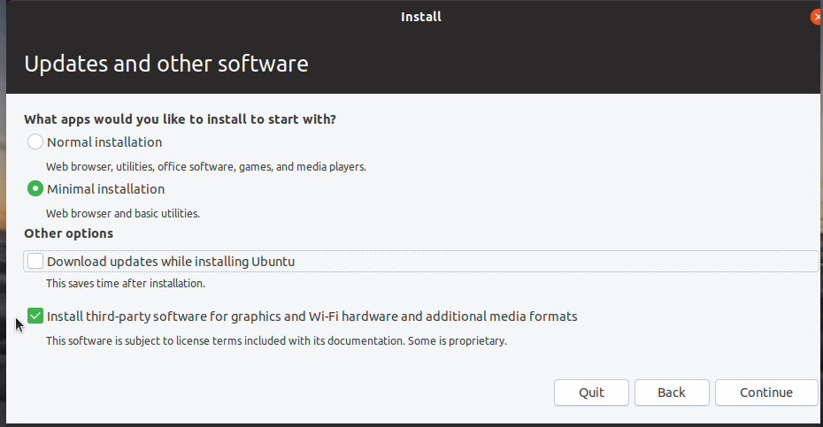
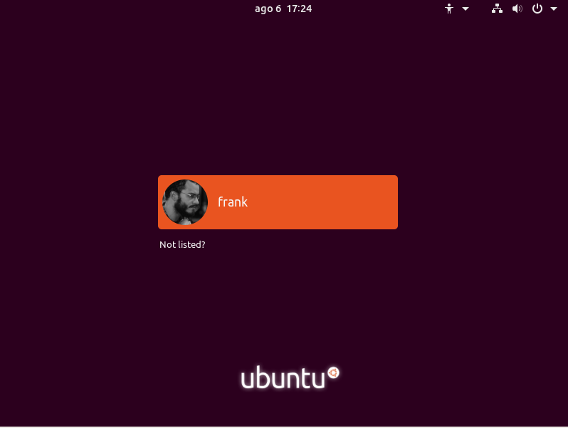

<p align="center">
  
  </br>
  <em> Logo designed by <a href="https://github.com/familqasimov">Famil Qasimov</a> </em>
</p>

<p align="center">
  <a href="https://img.shields.io/badge/ubuntu-18.04-E95420.svg">
    
  </a>
  <a href="https://img.shields.io/badge/ubuntu-19.04-77216F.svg">
    
  </a>
  <a href="https://img.shields.io/badge/language-ansible-2196F3.svg">
    
  </a>
  <a href="https://img.shields.io/badge/language-shell-43A047.svg">
    
  </a>
</p>

## Description
Install the first packages and make my initial configs in a Ubuntu post-installation. Its recommended Ubuntu 18.04 or 19.04 with "Minimal Installation" option selected.

<p align="center">
  
  </br>
</p>

**PS: In case of Ubuntu 19.04, is necessary change the update server in "Software Updater" to "Main Server", before run script. See the image below:**

The project is divided in 2 parts

> 1. Base

This installation contains a principal packages installations and is triggered by [``trigger.sh``](https://raw.githubusercontent.com/frankjuniorr/ubuntu_install/master/code/trigger.sh)

> 2. Optional

This installation contains others kind of packages not so importants to initial setup (ex. Telegram, LibreOffice and Transmission)

## Base Installation (steps)

### 1. Initial Upgrade
The script make the initial config with `sudo apt upgrade && sudo apt dist-upgrade`
### 2. Install packages
Install many packages. Basically the packages are:
- Player: Spotify
- IDE: Visual Studio Code
- Browser: Google Chrome
- Terminal: Terminator
- Some tools like: 
  - dropbox
  - docker
  - git, git-extras, meld
  - vim , nano
  - curl, wget
  - zip, bzip2, unzip... and other extract packages
  - gnome_tweak-tool
  - neofetch
  - imagemagick
  - and others stuffs

### 3. Clean dependencies
Clean packages with `sudo apt -f -y install` to fix broken packages and `sudo apt-get autoremove && sudo apt-get clean` to clean.
### 4. Download my dotfiles
Download my [Dotfiles repository](https://github.com/frankjuniorr/dotfiles), but not install, only download. Because of my dotfiles installation is necessary the user interation.
### 5. Change GDM profile picture
<p align="center">
  
  </br>
</p>

## Install without git in a Ubuntu formatted
```bash
wget -O - https://git.io/fjqyx | bash
```
This shorten link ``https://git.io/fjqyx`` is pointed to ``https://raw.githubusercontent.com/frankjuniorr/ubuntu_install/master/code/trigger.sh``
